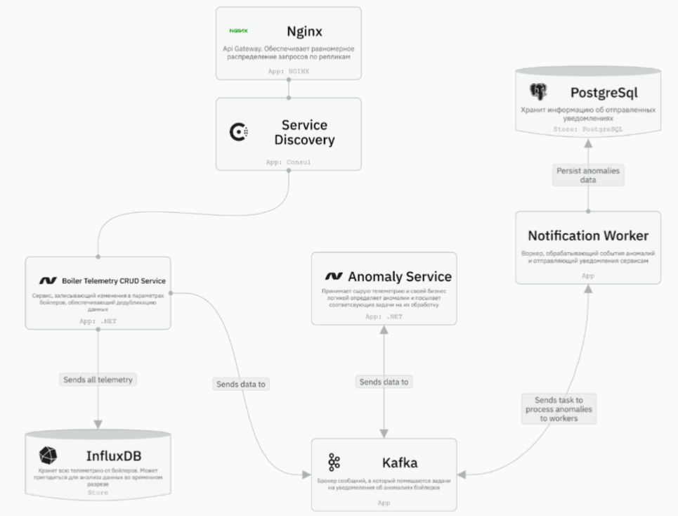
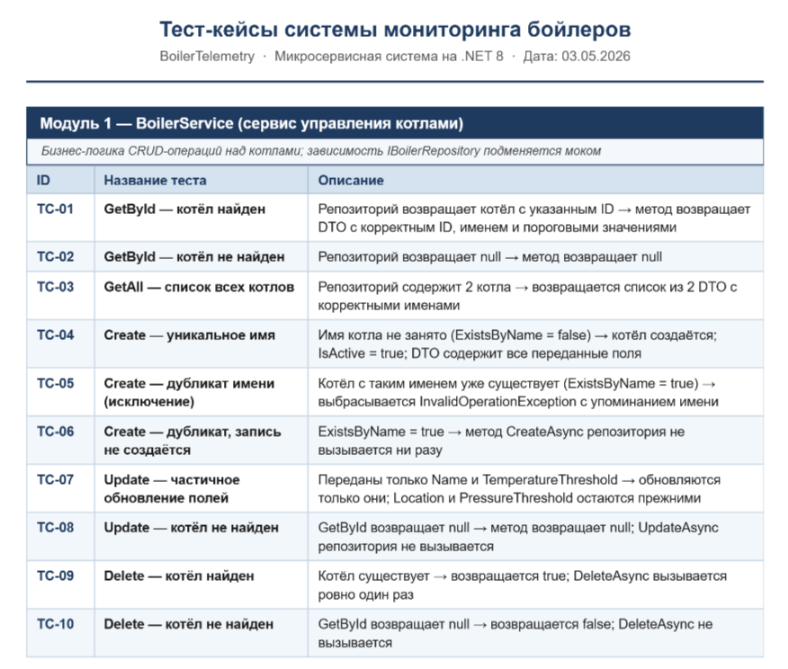
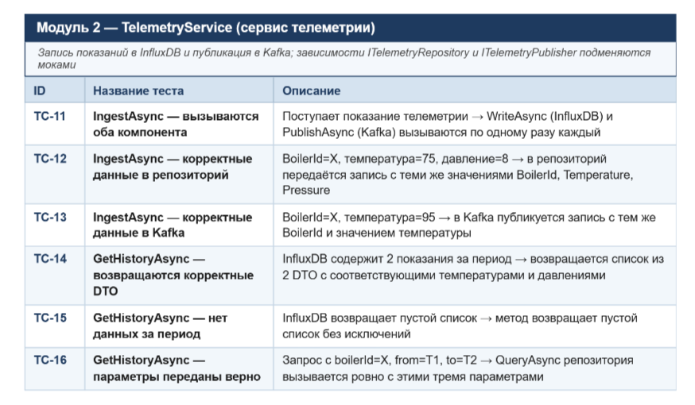
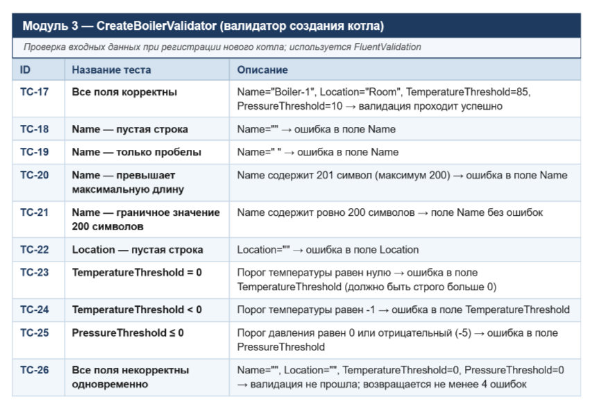
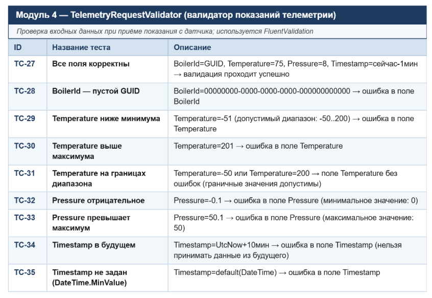
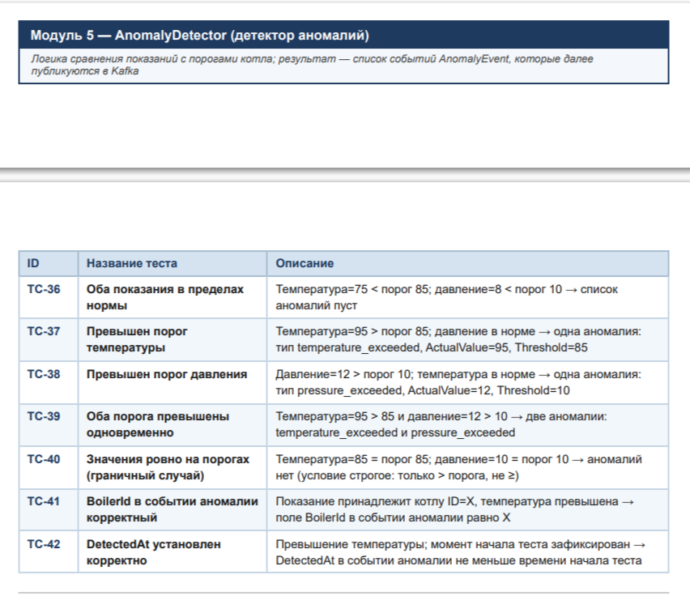

# Boiler Telemetry

Система мониторинга и оповещения о состоянии бойлеров: телеметрия → InfluxDB + Kafka → детекция аномалий → уведомления.

## 🚀 Быстрый запуск (Linux + minikube)

Один раз на свежей VM:
```bash
./bootstrap.sh        # ставит docker, minikube, kubectl, helm, make
```

Полный деплой одной командой:
```bash
make up
```

`make up` поднимает Postgres+InfluxDB в Docker (вне k8s), стартует minikube, собирает 3 .NET-образа и заливает их в minikube, ставит Helm-чарт (API + AnomalyService + NotificationWorker по 2 реплики, Kafka, Redis, OpenSearch + Dashboards, Jaeger, Prometheus, Grafana, Kafka UI), поднимает port-forward'ы на UI и печатает URL'ы.

## 📋 Команды

```bash
make status          # поды, реплики, HPA, состояние БД
make ports           # перепустить port-forward'ы и распечатать URL
make ports-stop      # прибить port-forward'ы
make logs SVC=api    # логи (api / anomaly-service / notification-worker / nginx / kafka / opensearch / grafana / prometheus / jaeger / kafka-ui)
make reload-images   # пересобрать образы и перезапустить деплои
make reset-grafana   # сбросить пароль Grafana к admin/admin
make down            # снести релиз и БД (volumes остаются)
make clean           # снести всё включая volumes и minikube
make help            # список целей
```

## 🌐 UI

После `make up` (или `make ports`) открывай:

| URL                       | Сервис                  | Креды             |
|---------------------------|-------------------------|-------------------|
| http://localhost:18080    | API                     | —                 |
| http://localhost:3000     | Grafana                 | `admin` / `admin` |
| http://localhost:5601     | OpenSearch Dashboards   | —                 |
| http://localhost:16686    | Jaeger UI               | —                 |
| http://localhost:8085     | Kafka UI                | —                 |
| http://localhost:9090     | Prometheus              | —                 |
| http://localhost:28086    | InfluxDB UI             | `admin` / `adminpassword` |

Подробности (что в каком UI смотреть, KQL-фильтры, примеры PromQL) — в **`ACCESS.md`**.

## 🧪 Postman

Импортируй `boiler-telemetry.postman_collection.json` — 10 запросов: CRUD бойлера, нормальная и аномальная телеметрия, история, валидация. Запросы используют `http://localhost:18080`.

## 📐 Архитектура

- **3 сервиса .NET 8** в k8s по 2 реплики, HPA до 4–6, PDB minAvailable=1.
- **PostgreSQL + InfluxDB** работают в Docker на хосте (`infra/databases/docker-compose.yml`). Внутри кластера ExternalName-сервисы `postgres` и `influxdb` резолвятся в `host.minikube.internal`.
- **Kafka** (apache/kafka 3.7 в KRaft mode), **Redis** — в k8s.
- **Observability**: OpenSearch+Dashboards (логи через Serilog), Jaeger (трейсы через OpenTelemetry OTLP), Prometheus (метрики через prometheus-net), Grafana (3 datasource + готовый дашборд `Boiler Telemetry — Overview` через provisioning).

Полный набор требований и use cases — ниже в этом файле.

---

### 1. Видение продукта 

Создать масштабируемую, отказоустойчивую и надежную платформу мониторинга бойлеров, которая в реальном времени собирает показания датчиков, автоматически выявляет аномалии и оперативно уведомляет ответственные системы или персонал, предотвращая аварии, простой оборудования и финансовые потери.

### 2. Проблема

В системах теплоснабжения и промышленного оборудования:
- Аномалии (перегрев, превышение давления) могут привести к авариям.
- Ручной контроль показаний невозможен в режиме 24/7.
- Отсутствие централизованного мониторинга усложняет диагностику.
- Задержка уведомлений увеличивает риски ущерба.

# Функциональные требования

### 1. Требования к приему данных
- Система должна принимать показания датчиков бойлеров по HTTP.
- Система должна валидировать входящие данные.
- Система должна отклонять некорректные запросы.
- Система должна поддерживать одновременный прием данных от нескольких датчиков.

### 2. Требования к хранению данных

- Система должна сохранять показания датчиков в базе данных.
- Система должна обеспечивать возможность получения истории показаний по датчику по временному срезу.
- Система должна обеспечивать CRUD-операции над бойлерами.

### 3. Требования к обнаружению аномалий
- Система должна анализировать поступающие показания на наличие аномалий.
- Система должна определять аномалию при превышении допустимых порогов.
- Система должна формировать событие об аномалии для уведомления пользователей.


# Нефункциональные требования

### 1. Производительность (Performance)
Система должна обеспечивать обработку телеметрических данных от датчиков бойлеров с пропускной способностью не менее 100 000 сообщений в секунду.

#### Требования:
- Система должна обрабатывать не менее 100 000 telemetry events/sec.
- Средняя задержка обработки одного сообщения (от приёма до записи в InfluxDB и публикации в Kafka) — не более 200 мс.
- Задержка обнаружения аномалии — не более 500 мс с момента поступления телеметрии.
- Задержка отправки уведомления — не более 2 секунд после публикации события об аномалии. 95-й перцентиль (p95 latency) обработки не должен превышать 400 мс.
99-й перцентиль (p99 latency) — не более 1с.

### 2. Масштабируемость (Scalability)
Система должна поддерживать горизонтальное масштабирование компонентов без остановки сервиса.

#### Требования:
- CRUD Service, Anomaly Detection Service и Notification Worker должны поддерживать горизонтальное масштабирование путём увеличения числа реплик.
- Kafka должна поддерживать не менее N partitions, достаточных для параллельной обработки 100k msg/sec.
- Масштабирование должно выполняться без простоя системы (zero downtime).
- Система должна поддерживать добавление новых нод без остановки обработки данных.


### 3. Надежность (Reliability)
Система должна обеспечивать устойчивость к отказам при высокой нагрузке.

#### Требования:
- Потеря телеметрических данных недопустима.
- Kafka должна быть развернута с replication factor больше единицы
- PostgreSQL и InfluxDB должны иметь резервное копирование и репликацию.
- При отказе одного экземпляра сервиса восстановление обработки должно происходить в течение 30 секунд.

### 4. Наблюдаемость (Observability)
Система должна обеспечивать полную мониторинг и диагностику при нагрузке 100k req/sec.

#### Требования:
- Все сервисы должны предоставлять /health endpoint.
- Должны собираться следующие метрики:
    - входной RPS
    - latency (avg, p95, p99)
    - CPU и memory usage
    - количество ошибок (error rate)
- Логи должны централизованно храниться не менее 7 дней.
- Доступны графики в Grafana по основным метрикам.
- MTTR (время восстановления после сбоя) — не более 15 минут.

# Use Cases

### Use Case 1. Отправка телеметрии датчиком.
**Актор**: датчик бойлера. <br>
**Цель** - передать показания в систему. <br>
**Предусловия:** датчик зарегистрирован, API доступен. <br>
Основной сценарий: датчик отправляет POST-запрос с телеметрией, система принимает и валидирует данные, сохраняет их в InfluxDB и публикует событие в Kafka. данные чистые - без аномалий.<br>
**Альтернативные сценарии:** при невалидных данных система возвращает ошибку 400; при недоступности сервиса датчик выполняет повторную отправку. 
Ожидаемый результат: данные успешно сохранены и переданы в очередь для дальнейшей обработки. 

### Use Case 2. Обнаружение аномалии.

**Актор:** сервис обнаружения аномалий. <br>
**Цель** - выявить отклонения в показаниях. <br>
**Предусловия:** данные поступили в Kafka, заданы пороговые значения. Основной сценарий: сервис читает сообщение из Kafka, анализирует параметры, сравнивает с порогами, при превышении формирует событие об аномалии и публикует его в Kafka для воркеров уведомлений. <br>
**Альтернативные сценарии:** если значения в норме - событие на уведомление не создается; при недоступности Kafka выполняется повторная попытка обработки. 
**Ожидаемый результат:** при обнаружении отклонения формируется событие аномалии.

### Use Case 3. Отправка уведомления.

**Актор:** сервис уведомлений (Notification Worker). <br>
**Цель** - уведомить пользователя или внешнюю систему об аномалии.<br>
**Предусловия:** событие об аномалии доступно в Kafka. <br>
**Основной сценарий:** сервис читает событие, определяет получателей, формирует уведомление и направляет его через внешний канал (например на email). 
**Альтернативные сценарии:** при недоступности внешнего сервиса выполняется повторная отправка; при отсутствии получателя фиксируется ошибка в логах. <br>
**Ожидаемый результат:** уведомление успешно доставлено адресату.

### Use Case 4. Получение истории показаний.

**Актор:** пользователь или внешняя система. <br>
**Цель** - получить исторические данные по бойлеру. <br>
**Предусловия:** данные ранее сохранены в системе. <br>
**Основной сценарий:** пользователь отправляет GET-запрос с параметрами (идентификатор бойлера и временной диапазон), система валидирует запрос, выполняет выборку из InfluxDB и возвращает список показаний.<br>
**Альтернативные сценарии:** при некорректных параметрах возвращается ошибка 400; при отсутствии данных возвращается пустой результат. Ожидаемый результат: пользователь получает корректную историю показаний.

### Use Case 5. Управление бойлерами (CRUD).

**Актор**: администратор. <br>
**Цель** - создавать и управлять сущностями бойлеров. <br>
**Предусловия:** администратор авторизован. <br>
**Основной сценарий:** администратор отправляет запрос на создание 
бойлера, система валидирует данные, сохраняет запись в PostgreSQL и возвращает подтверждение. <br>
**Альтернативные сценарии:** при невалидных данных возвращается ошибка 400; при попытке создать дубликат - ошибка 409.<br>
**Ожидаемый результат:** новый бойлер успешно создан и доступен для дальнейшей работы системы. 

# С4 диаграмма




## Test cases







