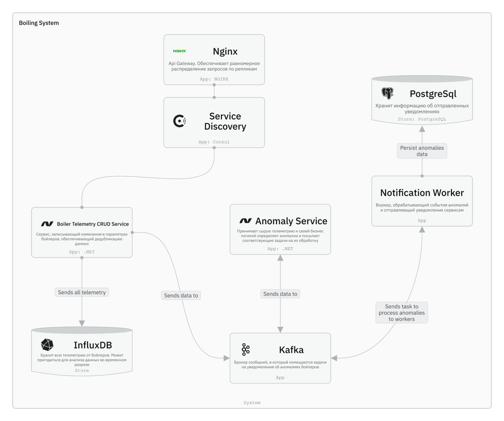
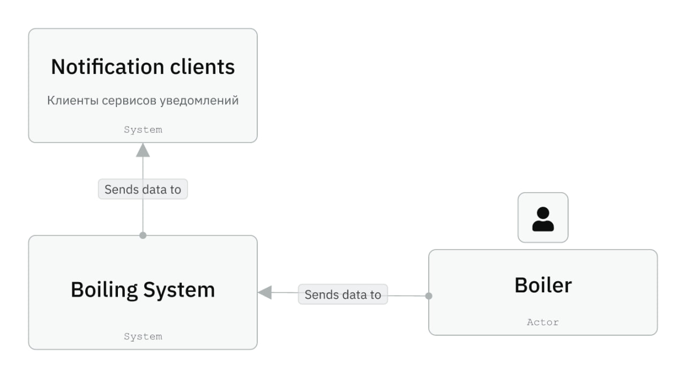

# Boiler Telemetry

Система мониторинга и оповещения о состоянии бойлеров: телеметрия → InfluxDB + Kafka → детекция аномалий → уведомления.

## Быстрый запуск (Linux + minikube)

Один раз для установки всех зависимостей:
```bash
./bootstrap.sh 
```

Положить креды:
```bash
cp .env.example .env
```

Полный деплой:
```bash
make up
```

> Все пароли/токены берутся из `.env`. Шаблон со списком переменных — `.env.example`. Скрипты деплоя подхватят данные оттуда автоматически

## Команды

```bash
make status          # поды, реплики, HPA, состояние БД
make ports           # перепустить port-forward'ы и распечатать URL
make ports-stop      # прибить port-forward'ы
make logs SVC=api    # логи (api / anomaly-service / notification-worker / nginx / kafka / opensearch / grafana / prometheus / jaeger / kafka-ui)
make reload-images   # пересобрать образы и перезапустить деплои
make reset-grafana   # сбросить пароль Grafana к admin/admin
make backup-now      # принудительный бэкап Postgres+Influx
make list-backups    # какие есть бэкапы
make restore-postgres FILE=last/boiler_telemetry-latest.sql.gz   # восстановить из дампа
make down            # снести релиз и БД (volumes остаются)
make clean           # снести всё включая volumes и minikube
make help            # помощь
```

## UI

После `make up` (или `make ports`) открывай:

| URL                       | Сервис                  | Креды                                                                |
|---------------------------|-------------------------|----------------------------------------------------------------------|
| http://localhost:18080    | API                     | —                                                                    |
| http://localhost:3000     | Grafana                 | `GRAFANA_ADMIN_USER` / `GRAFANA_ADMIN_PASSWORD` из `.env`             |
| http://localhost:5601     | OpenSearch Dashboards   | —                                                                    |
| http://localhost:16686    | Jaeger UI               | —                                                                    |
| http://localhost:8085     | Kafka UI                | —                                                                    |
| http://localhost:9090     | Prometheus              | —                                                                    |
| http://localhost:28086    | InfluxDB UI             | `INFLUX_ADMIN_USER` / `INFLUX_ADMIN_PASSWORD` из `.env`              |

---

### 1. Видение продукта 

Создать масштабируемую, отказоустойчивую и надежную платформу мониторинга бойлеров, которая в реальном времени собирает показания датчиков, автоматически выявляет аномалии и оперативно уведомляет ответственные системы или персонал, предотвращая аварии, простой оборудования и финансовые потери.

### 2. Проблема

В системах теплоснабжения и промышленного оборудования:
- Аномалии (перегрев, превышение давления) могут привести к авариям.
- Ручной контроль показаний невозможен в режиме 24/7.
- Отсутствие централизованного мониторинга усложняет диагностику.
- Задержка уведомлений увеличивает риски ущерба.

# Функциональные требования

### 1. Требования к приему данных
- Система должна принимать показания датчиков бойлеров по HTTP.
- Система должна валидировать входящие данные.
- Система должна отклонять некорректные запросы.
- Система должна поддерживать одновременный прием данных от нескольких датчиков.

### 2. Требования к хранению данных

- Система должна сохранять показания датчиков в базе данных.
- Система должна обеспечивать возможность получения истории показаний по датчику по временному срезу.
- Система должна обеспечивать CRUD-операции над бойлерами.

### 3. Требования к обнаружению аномалий
- Система должна анализировать поступающие показания на наличие аномалий.
- Система должна определять аномалию при превышении допустимых порогов.
- Система должна формировать событие об аномалии для уведомления пользователей.


# Нефункциональные требования

### 1. Производительность (Performance)
Система должна обеспечивать обработку телеметрических данных от датчиков бойлеров с пропускной способностью не менее 100 000 сообщений в секунду.

#### Требования:
- Система должна обрабатывать не менее 100 000 telemetry events/sec.
- Средняя задержка обработки одного сообщения (от приёма до записи в InfluxDB и публикации в Kafka) — не более 200 мс.
- Задержка обнаружения аномалии — не более 500 мс с момента поступления телеметрии.
- Задержка отправки уведомления — не более 2 секунд после публикации события об аномалии. 95-й перцентиль (p95 latency) обработки не должен превышать 400 мс.
99-й перцентиль (p99 latency) — не более 1с.

### 2. Масштабируемость (Scalability)
Система должна поддерживать горизонтальное масштабирование компонентов без остановки сервиса.

#### Требования:
- CRUD Service, Anomaly Detection Service и Notification Worker должны поддерживать горизонтальное масштабирование путём увеличения числа реплик.
- Kafka должна поддерживать не менее N partitions, достаточных для параллельной обработки 100k msg/sec.
- Масштабирование должно выполняться без простоя системы (zero downtime).
- Система должна поддерживать добавление новых нод без остановки обработки данных.


### 3. Надежность (Reliability)
Система должна обеспечивать устойчивость к отказам при высокой нагрузке.

#### Требования:
- Потеря телеметрических данных недопустима.
- Kafka должна быть развернута с replication factor больше единицы
- PostgreSQL и InfluxDB должны иметь резервное копирование и репликацию.
- При отказе одного экземпляра сервиса восстановление обработки должно происходить в течение 30 секунд.

### 4. Наблюдаемость (Observability)
Система должна обеспечивать полную мониторинг и диагностику при нагрузке 100k req/sec.

#### Требования:
- Все сервисы должны предоставлять /health endpoint.
- Должны собираться следующие метрики:
    - входной RPS
    - latency (avg, p95, p99)
    - CPU и memory usage
    - количество ошибок (error rate)
- Логи должны централизованно храниться не менее 7 дней.
- Доступны графики в Grafana по основным метрикам.
- MTTR (время восстановления после сбоя) — не более 15 минут.

# С4 диаграмма




### Use Cases смотреть в файле use-cases.md
### Test Cases смотреть в файле test-cases.md